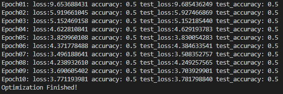

# Tensorflow_RNN_IMDB_Sentiment_Classification

## github
https://github.com/benlin131020/Tensorflow_RNN_IMDB_Sentiment_Classification

## 網路架構


## accuracy & loss




accuracy 數值一直是0.5沒有變動，loss 有持續下降， 但數值仍然過高。

training data 與 testing data 的 loss 數值極度接近。

推測尚須更複雜的模型、加入 word embedding 及更多的 epoch。

## 開啟tensorboard
```
cd Tensorflow_RNN_IMDB_Sentiment_Classification
tensorboard --logdir logs
```
